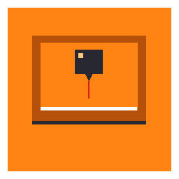
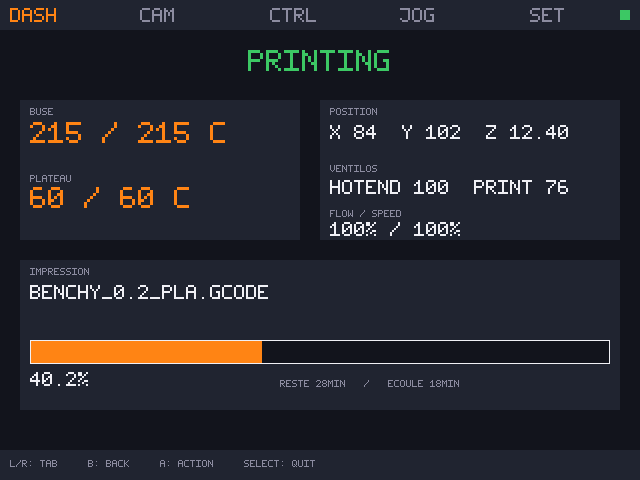
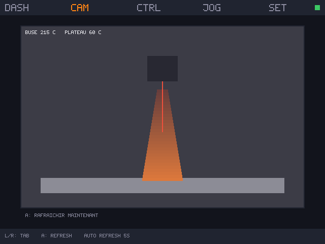
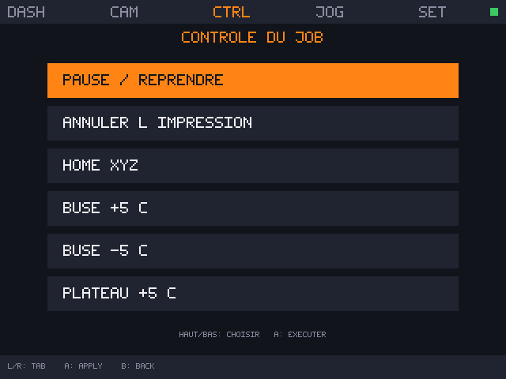
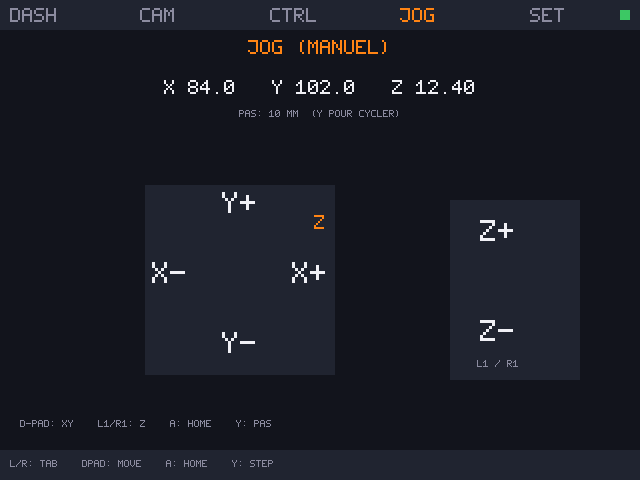
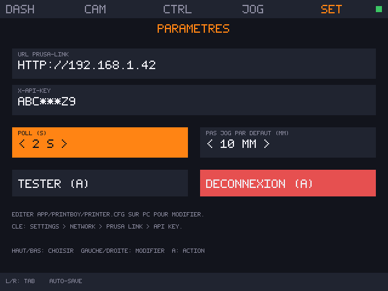

# 🖨️ PrintBoy 🎮

[](https://github.com/OnionUI/Onion)
[](https://github.com/prusa3d/Prusa-Link)
[](https://github.com/OnionUI/Onion)
[](LICENSE)

> 🛰️ **Ta Prusa dans ta poche, pilotée à la manette.**
> Surveille la progression, regarde la webcam, mets en pause, déplace la tête, préchauffe et change les températures — le tout depuis ta Miyoo Mini Plus, en WiFi local.

> 🎮 *Le nom est un clin d'œil au **Game Boy Printer** : ici, c'est la console qui pilote l'imprimante.*

<p align="center"></p>

---

## 🤔 C'est quoi ?

PrintBoy est une **app Onion** pour Miyoo Mini Plus qui parle à l'API REST de **Prusa-Link** (le serveur HTTP **local** qui tourne sur les imprimantes Prusa MK3.x/MK4/Mini/XL).

🎯 Pas de cloud, pas de compte, pas d'Internet — juste ta console et ton imprimante sur le même WiFi.

| 📊 Dashboard | 📷 Webcam |
|---|---|
|  |  |

| 🎛️ Contrôles | 🕹️ Jog XYZ | ⚙️ Paramètres |
|---|---|---|
|  |  |  |

> 🖼️ Ce sont des **mockups générés** par `scripts/make-mockups.py` (pas encore des captures réelles : le binaire ARM est compilé par CI). Ils représentent fidèlement le rendu final.

---

## ✨ Fonctionnalités

- 📊 **Dashboard temps réel** : état (IDLE / PRINTING / PAUSED / ERROR), températures buse + plateau, position X/Y/Z, ventilos, flow, speed
- 📈 **Progression d'impression** : nom du fichier, barre %, temps restant, temps écoulé
- 📷 **Webcam** : snapshot JPEG via `/api/v1/cameras/{id}/snap`, rafraîchi auto toutes les 5 s, avec **découverte auto de la caméra** (`/api/v1/cameras`) si le status n'en expose pas
- ⏸️ **Pause / Reprendre / Annuler** un job
- 🏠 **Home XYZ** d'un bouton
- 🌡️ **Régler les températures** buse **et** plateau par paliers de ±5 °C
- 🔥 **Préchauffage PLA** (215/60) en un appui, et **Refroidir tout** (buse + plateau à 0 °C)
- 🕹️ **Jog manuel** XYZ avec pas 1 / 10 / 50 mm — le pas par défaut est repris depuis `printer.cfg`
- 🔐 **Sauvegarde** locale de l'URL + clé API (dans `printer.cfg`)
- 🚪 **Déconnexion** propre depuis l'écran Settings (efface URL + clé)
- 📶 **Détection WiFi off** : message clair au lancement si tu as oublié de l'activer
- 🛠️ Stack : C + libcurl + cJSON + SDL2 — code compact et lisible

---

## 📋 Prérequis

- 🎮 **Miyoo Mini Plus** (le Miyoo Mini standard **n'a pas de WiFi**, ça ne marche pas)
- 🧅 **OnionOS** v4.3.x installé et fonctionnel
- 📶 **WiFi activé sur Onion** (Menu → Network → WiFi ON)
- 🖨️ **Imprimante Prusa** avec **Prusa-Link** activé :
  - MK4 / Mini / XL : Prusa-Link est intégré (à activer dans le menu réseau)
  - MK3.x : nécessite un Raspberry Pi avec Prusa-Link installé dessus
- 🔑 **Clé API** : sur l'imprimante, va dans **Settings → Network → Prusa Link → API key**

---

## 🚀 Installation

Voir [INSTALL.md](INSTALL.md). Résumé :

1. 📥 Télécharge la dernière release `PrintBoy_vX.Y.Z.zip` depuis l'onglet Releases.
2. 🔌 Branche la SD du Miyoo sur le PC.
3. 📂 Copie le dossier `App/PrintBoy/` du zip vers `<SD>/App/PrintBoy/`.
4. 🖼️ Copie `Icons/Default/app/printboy.png` vers `<SD>/Icons/Default/app/`.
5. ⚙️ Édite `<SD>/App/PrintBoy/printer.cfg` (ou laisse le défaut et configure depuis l'app) :
   ```
   url = http://192.168.1.42
   api_key = <copie ce que t'affiche ton imprimante>
   ```
6. ⏏️ Éjecte proprement, mets la SD dans la Miyoo, allume.
7. 🧅 Onion → Apps → **PrintBoy** : ça démarre.

---

## 🎮 Commandes

| Bouton | Action |
|---|---|
| **L1 / R1** | Changer d'onglet (← Dashboard / Webcam / Controls / Jog / Settings →) |
| **D-pad** | Naviguer dans l'écran courant / déplacer (Jog) |
| **A** | Action principale (exécuter, refresh, sauver, home) |
| **B** | Retour |
| **Y** | Cycler le pas de jog (1 / 10 / 50 mm) |
| **SELECT** | Quitter PrintBoy (retour à Onion) |

---

## 🔌 Quels endpoints Prusa-Link sont utilisés ?

| Endpoint | Utilisation |
|---|---|
| `GET /api/v1/status` | Poll principal (état, temps, position, progression) |
| `PUT /api/v1/job/{id}/pause` | Pause de l'impression |
| `PUT /api/v1/job/{id}/resume` | Reprendre |
| `DELETE /api/v1/job/{id}` | Annuler |
| `POST /api/printer/printhead` | Jog XYZ + Home |
| `POST /api/printer/tool` | Cible buse (températures + préchauffage + refroidissement) |
| `POST /api/printer/bed` | Cible plateau |
| `GET /api/v1/cameras` | Découverte de la caméra (fallback si le status n'en liste pas) |
| `GET /api/v1/cameras/{id}/snap` | Snapshot webcam (JPEG) |

Auth : header `X-Api-Key: <clé>` sur toutes les requêtes.

---

## 🛠️ Compilation depuis les sources

Voir [BUILD.md](BUILD.md). En gros :

```bash
make with-toolchain          # Build via Docker miyoomini-toolchain
# -> build/printboy à copier dans App/PrintBoy/bin/
```

La CI GitHub Actions fait ça à chaque tag `v*` et publie un zip avec SHA-256.

---

## 🔒 Sécurité

Voir [SECURITY.md](SECURITY.md). Points importants :

- 🔓 Prusa-Link sert sur **HTTP en clair** par défaut (pas HTTPS). Sur ton WiFi domestique c'est ok, mais sur un WiFi public **ta clé API circule en clair**. À éviter.
- 🔑 La clé API a un pouvoir total sur l'imprimante (lancer, annuler, chauffer à 300 °C). Ne la commit pas sur GitHub. `.gitignore` exclut `printer.cfg`.
- 🚪 Le bouton **Déconnexion** dans Settings efface `url` et `api_key` du fichier `printer.cfg`.

---

## 📜 Crédits

- 🍊 [Prusa Research](https://github.com/prusa3d) pour Prusa-Link et l'API REST documentée
- 🧅 [OnionUI](https://github.com/OnionUI/Onion) pour le format App + le firmware
- 🎮 Le projet Miyoo + la communauté retro pour avoir mis du WiFi dans une console de poche

Voir [NOTICE.md](NOTICE.md) pour les licences.

---

## 📝 License

MIT — voir [LICENSE](LICENSE).

> Repo privé par défaut. Les images sont des mockups générés, à remplacer par
> des captures réelles dès que le binaire est testé sur console.
